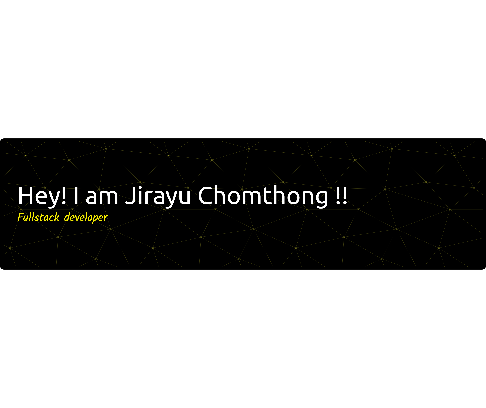

# Hi, I'm Jirayu Chomthong 👋

### Full-Stack Developer · AI & Automation Enthusiast

ผมชอบสร้างเว็บแอปที่ใช้งานได้จริง เชื่อมต่อ AI และออกแบบระบบให้พร้อมเติบโตไปพร้อมกับผู้ใช้

---

## 👨‍💻 About Me

- 🎓 นักศึกษาวิทยาการคอมพิวเตอร์ มหาวิทยาลัยราชภัฏบุรีรัมย์
- 🚀 สนใจงาน **Full-Stack Development** และการออกแบบระบบที่รวดเร็ว รองรับการขยายตัว
- 🤖 สนใจการประยุกต์ใช้ **AI, RAG, Function Calling และ Workflow Automation** เพื่อแก้ปัญหาในโลกจริง
- 🎯 เปิดรับโอกาสฝึกงานในตำแหน่ง **Full-Stack Developer**

## 🛠️ Tech Stack

#### Frontend

#### Backend & Database

#### DevOps & Tools

#### AI & Integrations

Also working with Elysia.js, Nuxt UI, shadcn/ui and LIFF

## 🚀 Featured Projects

### 🧺 SaiJai Phareab Laundry Service

**Senior Project · Ongoing** — ระบบบริหารจัดการร้านซักรีดแบบ Full-Stack พร้อมระบบจัดคิวอัตโนมัติ ติดตามสถานะออเดอร์แบบ Real-time ระบบโปรโมชัน และ AI Chatbot แบบ Function Calling

`Nuxt` `TypeScript` `PostgreSQL` `Prisma`

### 🧠 Mental Health Support & Depression Screening AI Chatbot

ผลงานในการแข่งขัน **8th BRICC Festival 2025** — แชตบอต AI สำหรับคัดกรองภาวะซึมเศร้าและให้คำปรึกษาเบื้องต้น โดยเรียนรู้บริบททางอารมณ์จากบทสนทนาในชุมชนออนไลน์ เพื่อสร้างคำตอบที่มีความเห็นอกเห็นใจ

### 🏆 Super AI Engineer Development Program Innovator 2025

- **Phattharaborpit School AI Chatbot** — แชตบอตให้ข้อมูลกิจการนักเรียนและกฎระเบียบของโรงเรียน
- **Buriram Brainwave AI** — ออกแบบสถาปัตยกรรมแพลตฟอร์มศูนย์รวมหลักสูตรและวัฒนธรรมระดับจังหวัด พร้อมแชตบอตแนะนำคอร์สเรียน

### 🏛️ Public Service & Agriculture Chatbots

ระบบ AI แบบ RAG เชื่อมต่อ LINE OA สำหรับ **อบต.สระแก้ว**, **อบต.หนองชัยศรี** และ **โครงการ BRU เพื่อการเกษตร** ช่วยให้ประชาชนและเกษตรกรเข้าถึงข้อมูลได้สะดวกขึ้น

---

## 🏅 Certifications & Achievements

### Highlights

| Year | Certification / Achievement | Issuer |
|:---:|---|---|
| **2026** | [AWS Thaksa AI](https://github.com/jirayu-ct-dev/My-Certificates/blob/main/AWS%20Thaksa%20AI_%E0%B8%88%E0%B8%B4%E0%B8%A3%E0%B8%B2%E0%B8%A2%E0%B8%B8%20%E0%B8%8A%E0%B8%A1%E0%B8%97%E0%B8%AD%E0%B8%87.pdf) | Thammasat University & AWS |
| **2026** | [มาตรฐานอาชีพนักพัฒนาระบบ ระดับ 3](https://github.com/jirayu-ct-dev/My-Certificates/blob/main/%E0%B8%AB%E0%B8%A5%E0%B8%B1%E0%B8%81%E0%B8%AA%E0%B8%B9%E0%B8%95%E0%B8%A3%20%E0%B8%99%E0%B8%B1%E0%B8%81%E0%B8%9E%E0%B8%B1%E0%B8%92%E0%B8%99%E0%B8%B2%E0%B8%A3%E0%B8%B0%E0%B8%9A%E0%B8%9A%20%E0%B8%A3%E0%B8%B0%E0%B8%94%E0%B8%B1%E0%B8%9A%203.pdf) | ARIT |
| **2025** | [Super AI Engineer Season 5 — Foundation AI (Theory)](https://github.com/jirayu-ct-dev/My-Certificates/blob/main/Super%20AI%20Engineer%202025%20-%20EN.png) | Artificial Intelligence Association of Thailand |
| **2025** | [ผ่านเข้ารอบ 20 ทีม การประกวดโครงงานวิจัยระดับปริญญาตรี](https://github.com/jirayu-ct-dev/My-Certificates/blob/main/%E0%B9%80%E0%B8%81%E0%B8%B5%E0%B8%A2%E0%B8%A3%E0%B8%95%E0%B8%B4%E0%B8%9A%E0%B8%B1%E0%B8%95%E0%B8%A3-bricc-2025-20-%E0%B8%97%E0%B8%B5%E0%B8%A1.pdf) | 8th BRICC Festival |
| **2025** | [Building LINE Chatbot with ChatGPT and Gemini](https://github.com/jirayu-ct-dev/My-Certificates/blob/main/borntodev-academy_Building%20LINE%20Chatbot%20with%20ChatGPT%20and%20Gemini_certificate.png) | BorntoDev & LINE Developers |
| **2025** | [การใช้งาน AI for Thai เพื่อสร้างนวัตกรรม](https://github.com/jirayu-ct-dev/My-Certificates/blob/main/AI%20For%20Thai%20%E0%B9%80%E0%B8%9E%E0%B8%B7%E0%B9%88%E0%B8%AD%E0%B8%AA%E0%B8%A3%E0%B9%89%E0%B8%B2%E0%B8%87%E0%B8%99%E0%B8%A7%E0%B8%B1%E0%B8%95%E0%B8%81%E0%B8%A3%E0%B8%A3%E0%B8%A1.pdf) | NECTEC, AIAT & BRU |

### [ดูเกียรติบัตรทั้งหมด →](https://github.com/jirayu-ct-dev/My-Certificates)

---

### Let's build something useful together 🚀

📫 **jirayu.ct.dev@gmail.com**

